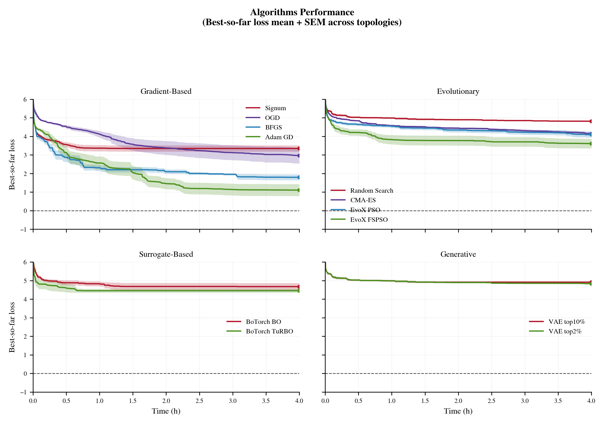

# Learn2Design-2026

A black-box optimization competition for gravitational-wave detector design.

You are given a fixed quasi-universal interferometer ([UIFO](https://github.com/artificial-scientist-lab/Differometor#differometor-for-the-computational-design-of-gravitational-wave-detectors)) with a fixed topology (meaning choice of optical components in the experiment) and
continuous parameters (laser powers, mirror reflectivities, grid distances, ...).
Your job is to find the parameter vector that maximises detector sensitivity,
within a fixed compute budget.

The objective function is pure and jax-based. It supports gradients and Hessians via auto-diff.

You submit algorithms. The best algorithm over 10 problems wins.

> **Status:** Pre-launch. The starting kit is being finalised. Further baselines
> and their results will be added until the start of the competition. `dfbench`'s
> repository will soon be made public.

---

## How it works

- Each month we publish 10 new public topologies. Submissions are scored on the 
  average best loss across all 10 of them.
- Your score will get published to that month's leaderboard.
- Every topology run gets 4 hours of wall-clock time on a single A100 GPU with 
  an AMD EPYC 7302 CPU.
- The final leaderboard is decided on 10 held-out private topologies that
  are never published.
- Your final score will be the mean of the best loss reached on the 10 private 
  problems. Lower is better.

A "topology" fixes the choice of optical components for a UIFO; you only optimize 
the continuous parameters attached to it. These could be laser power, mirror 
reflectivity, grid distance, etc.

---

## Install

Requires Python 3.11 or newer.

```bash
git clone https://github.com/artificial-scientist-lab/Learn2Design-2026
cd Learn2Design-2026
pip install -e .
```

If you want GPU support, make sure you have CUDA 12 or 13 installed:
```bash
pip install -e ".[cuda13]" # or ".[cuda12]"
```

This pulls in [`dfbench`](docs/dfbench/Architecture-Overview.md) (the benchmark
framework). `dfbench` in turn uses
[`differometor`](https://pypi.org/project/differometor/), the JAX-based
interferometer simulator.

Smoke-test one UIFO evaluation (may take a few minutes to JIT-compile) with [smoke_test.py](learn2design/scripts/smoke_test.py):
```bash
python learn2design/scripts/smoke_test.py
```
---

## Minimal working example

A submission is one class subclassing `OptimizationAlgorithm`:

```python
from dfbench.core import Objective, OptimizationAlgorithm
from jaxtyping import Array, Float


class MyAlgorithm(OptimizationAlgorithm):

    algorithm_str = "my_algo"

    def optimize(
        self,
        objective: Objective,
        init_params: Float[Array, "..."],
        random_seed: int | None = None,
        **kwargs,
    ) -> None:
        # 1. Warm up JIT (compilation is free, not counted against the budget)
        objective.warmup_value()

        # 2. Start the clock
        objective.start_logging()

        # 3. Optimization loop
        params = init_params
        while not objective.budget_exceeded:
            # ... your update logic here, producing `params` ...
            loss = objective.value(params)  # automatically logged
```

That is the entire contract. The `Objective` handles seeding, history,
checkpointing, and budget enforcement. You write the loop.


---

## What `Objective` gives you

| Method / attribute | Purpose |
|---|---|
| `objective.value(params)` | Forward pass; logged automatically. |
| `objective.value_and_grad(params)` | Loss and exact JAX gradient in one call. |
| `objective.warmup_value()` | JIT-compile before the timer starts. |
| `objective.start_logging()` | Begin the budget clock. |
| `objective.set_space_mode(unbounded, unit_mapping=None, inverse_unit_mapping=None)` | Switch between bounded and unbounded optimization space before optimization starts. |
| `objective.budget_exceeded` | Stop condition (max evals or wall time). |
| `objective.evals_since_improvement` | For your own early-stopping logic. |
| `objective.bounds` | Per-parameter `(low, high)` arrays. |
| `objective.random_params()` | Sample uniformly within bounds. |
| `objective.best_loss`, `objective.best_params_bounded` | Final results. |

Full reference: [`dfbench` docs](docs/dfbench/Objective-API-Reference.md).

---

## Repository layout

```
Learn2Design-2026/
├── learn2design/
│   ├── example_algorithms/  # Reference algorithm implementations
│   │   ├── random_search.py
│   │   └── adam_gd.py
│   └── scripts/             # Minimal runnable entry points
│       ├── uifo_random_search.py
│       └── uifo_adam_gd.py
├── docs/
│   ├── submission.md        # Submission rules
│   ├── scoring.md           # Scoring and leaderboard details
│   ├── FAQ.md               # WIP FAQ page
│   └── dfbench/             # Expanded benchmark framework documentation
│       └── FAQ.md
└── pyproject.toml
```

The repository is intentionally small. We tried to condense the relevant content for users.

---

## Baselines

The table below summarizes the baseline plots in [`baselines/`](baselines/).
Rows are ordered by displayed mean loss; ties in the rounded values are broken
by displayed SEM and then alphabetically.

Because this repository depends on `dfbench` as an external package, it does
not contain the `dfbench` source tree itself. The links below therefore open
the matching documented algorithm section in [`docs/dfbench/Algorithms.md`](docs/dfbench/Algorithms.md), using the exact class names and variants from that documentation.

Category-level overview across the baseline families:



| Rank & name | General type* | Detailed implementation | Average loss ± SEM | Link to implementation |
|---|---|---|---|---|
| 1. `AdamGD` | Gradient-based | Standard Adam optimizer utilizing gradient clipping for stability | 1.1 ± 0.3 | [AdamGD](docs/dfbench/Algorithms.md#L61) |
| 2. `NAAdamGD` | Gradient-based | Adam optimizer enhanced with decaying Gaussian noise to escape local optima | 1.2 ± 0.4 | [NAAdamGD](docs/dfbench/Algorithms.md#L112) |
| 3. `OptaxSGDM` | Gradient-based | Stochastic Gradient Descent (SGD) with momentum, implemented via Optax | 1.2 ± 0.4 | [OptaxSGDM](docs/dfbench/Algorithms.md#L1228) |
| 4. `SLSQP` | Gradient-based | Sequential Least Squares Programming (SciPy), well-suited for constrained optimization | 1.8 ± 0.07 | [SciPy gradient family](docs/dfbench/Algorithms.md#L163) |
| 5. `BFGS` | Gradient-based | BFGS quasi-Newton method (SciPy) for gradient-based optimization | 1.8 ± 0.2 | [SciPy gradient family](docs/dfbench/Algorithms.md#L163) |
| 6. `OptaxLAMB` | Gradient-based | LAMB optimizer (Optax) designed to adapt learning rates layer-by-layer | 1.8 ± 0.3 | [OptaxLAMB](docs/dfbench/Algorithms.md#L1158) |
| 7. `OptaxYogi` | Gradient-based | Yogi optimizer (Optax) featuring conservative variance updates for stable learning | 2.1 ± 0.4 | [OptaxYogi](docs/dfbench/Algorithms.md#L1357) |
| 8. `TNC` | Gradient-based | Truncated Newton algorithm (SciPy) supporting bound constraints | 2.8 ± 0.1 | [SciPy gradient family](docs/dfbench/Algorithms.md#L163) |
| 9. `LBFGSGD` | Gradient-based | Limited-memory BFGS (Optax) featuring a custom JIT-compiled logging loop | 2.9 ± 0.2 | [LBFGSGD](docs/dfbench/Algorithms.md#L146) |
| 10. `OptaxOGD` | Gradient-based | Optimistic Gradient Descent (Optax), predicting future gradients to accelerate convergence | 3.0 ± 0.4 | [OptaxOGD / OptaxOAdam](docs/dfbench/Algorithms.md#L1379) |
| 11. `OptaxSignum` | Gradient-based | Signum optimizer (Optax) utilizing the sign of gradients and momentum | 3.3 ± 0.2 | [OptaxSignum](docs/dfbench/Algorithms.md#L1390) |
| 12. `EvoxPSO (FSPSO)` | Evolutionary | Feature Selection Particle Swarm Optimization (EvoX) to maintain population diversity | 3.6 ± 0.3 | [EvoxPSO variants](docs/dfbench/Algorithms.md#L226) |
| 13. `OptaxRProp` | Gradient-based | Resilient Backpropagation (Optax), using only the sign of gradients for parameter updates | 3.8 ± 0.2 | [OptaxRProp](docs/dfbench/Algorithms.md#L1206) |
| 14. `CMAESCMA` | Evolutionary | Full-covariance CMA-ES using the `cmaes.CMA` backend | 4.1 ± 0.1 | [CMAESCMA](docs/dfbench/Algorithms.md#L449) |
| 15. `EvoxPSO (PSO)` | Evolutionary | Standard Particle Swarm Optimization (EvoX) simulating swarm behavior | 4.1 ± 0.2 | [EvoxPSO variants](docs/dfbench/Algorithms.md#L226) |
| 16. `BotorchTuRBO` | Surrogate-based | Trust Region Bayesian Optimization (TuRBO) using BoTorch's Gaussian processes | 4.5 ± 0.1 | [BotorchTuRBO](docs/dfbench/Algorithms.md#L639) |
| 17. `BotorchBO` | Surrogate-based | Bayesian Optimization (BoTorch) using Gaussian processes and qLogEI acquisition | 4.7 ± 0.2 | [BotorchBO](docs/dfbench/Algorithms.md#L619) |
| 18. `RandomSearch` | — | Uniform random sampling baseline evaluated in batches within bounds | 4.8 ± 0.03 | [RandomSearch](docs/dfbench/Algorithms.md#L218) |
| 19. `VAESampling top2%` | Generative | Variational Autoencoder sampling by latent-space search with Bayesian Optimization. Trained on top 2% of random search samples. | 4.8 ± 0.04 | [VAESampling](docs/dfbench/Algorithms.md#L957) |
| 20. `VAESampling top10%` | Generative | VAE trained on 10% of random search samples. | 4.8 ± 0.04 | [VAESampling](docs/dfbench/Algorithms.md#L957) |

*General types follow `dfbench`'s coarse `AlgorithmType` system:
gradient-based, evolutionary, surrogate-based, and generative.

---

## Submitting

Information about how to submit will be provided once the competition officially starts.

---

## Timeline

| Date | Event |
|---|---|
| Expected: 01.07.2026 | Start of competition |
| 1st week of August, September, October | Release of public leaderboard |
| 15.10.2026 | Final submission deadline |
| Before workshop | Private leaderboard announced |

---

## Resources

- **Repository:** <https://github.com/artificial-scientist-lab/Learn2Design-2026>
- **Issues / questions:** <https://github.com/artificial-scientist-lab/Learn2Design-2026/issues>
- **Simulator:** [`differometor`](https://pypi.org/project/differometor/)
- **Benchmark framework:** [`dfbench`](docs/dfbench/Architecture-Overview.md)
- **Group:** [Artificial Scientist Lab](https://www.artificial-scientist-lab.ai/)

A website, FAQ page, and contact email will be added before the competition
opens.

---

## Citing

```bibtex
@misc{learn2design2026,
  title  = {Learn2Design 2026: Black-box Optimization for Gravitational-Wave Detector Design},
  author = {Learn2Design collaboration},
  year   = {2026},
  url    = {https://github.com/artificial-scientist-lab/Learn2Design-2026},
}
```

## License

MIT — see [LICENSE](LICENSE).
