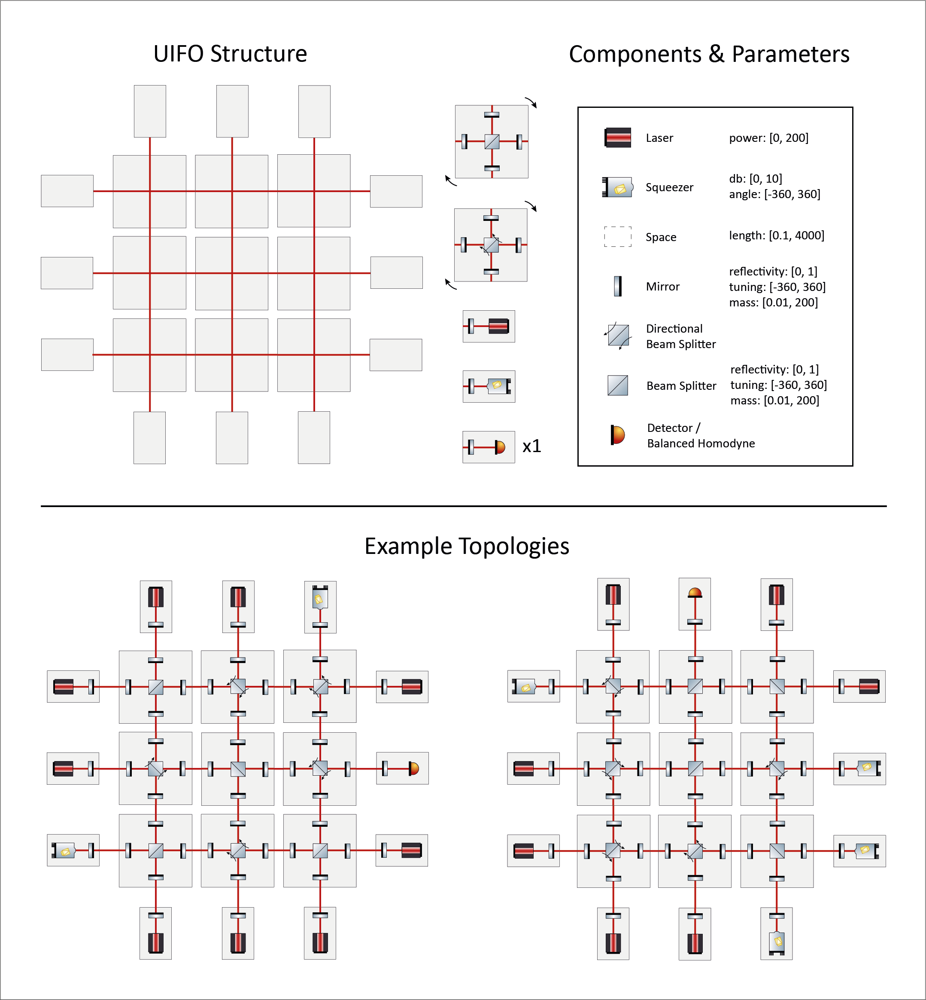

> [!IMPORTANT]
> **BETA RELEASE:** This repository is currently in beta. The official competition will start on **8.July 2026**.

# NeurIPS 2026 Challenge: Learn2Design-2026
[](https://github.com/artificial-scientist-lab/Learn2Design-2026/blob/main/LICENSE)
[](https://pypi.python.org/pypi/dfbench)
[](https://github.com/artificial-scientist-lab/Differometor-Benchmark)


## A physics experiment design competition for gravitational-wave detectors

<p align="center">
Jonathan Klimesch<sup>1</sup>, Laurin Sefa<sup>1</sup>, Soham Basu<sup>1</sup>, Priya Kanagasabapathi<sup>1</sup>,<br>
Sören Arlt<sup>1</sup>, Xuemei Gu<sup>2</sup>, Thomas Christie<sup>1</sup>, Colin Doumont<sup>1</sup>,<br>
Andreas Freise<sup>3</sup>, Rana Adhikari<sup>4</sup>, Philipp Hennig<sup>1</sup>, Mario Krenn<sup>1</sup>
</p>

<p align="center">
<sup>1</sup>Department for Computer Science, Faculty of Science, University of Tübingen, Tübingen, Germany<br>
<sup>2</sup>Institut für Festkörpertheorie und Optik, Friedrich-Schiller-Universität Jena, Jena, Germany<br>
<sup>3</sup>Nikhef, National Institute for Subatomic Physics, Amsterdam, The Netherlands<br>
<sup>4</sup>Institute for Quantum Information and Matter, California Institute of Technology, Pasadena, CA, USA
</p>

**Learn2Design-2026** is a NeurIPS 2026 challenge on the automated design of highly sensitive [gravitational-wave detectors](https://en.wikipedia.org/wiki/LIGO) under realistic experimental constraints.

Participants are given [a search space of gravitational-wave detectors](#quasi-universal-interferometer-uifo).
Within this search space, the task is to optimize roughly **200 continuous parameters**, such as laser powers, mirror reflectivities, grid distances, and related experimental degrees of freedom.

The goal is to develop an algorithm that **maximizes detector sensitivity** while satisfying physical and experimental constraints, all within a fixed compute budget. Participants submit the algorithm itself, not only a final design. The submitted algorithms will be run by the organizers on standardized local hardware and ranked by their average performance on hidden detector topologies.

The challenge provides the differentiable, JAX-based simulator **[Differometor](https://github.com/artificial-scientist-lab/Differometor)**. Its objective function is pure, JAX-compatible, and supports gradients and Hessians through automatic differentiation, enabling gradient-based, hybrid, and learning-based optimization strategies.

To support algorithm development, we also provide approximately **30,000 high-quality detector designs** generated through a **360,000 GPU-hour EuroHPC exploration campaign**. These examples can be used for supervised learning, initialization, representation learning, generative modeling, benchmarking, or other exploration and optimization approaches.

Algorithms will be ranked by their hidden-evaluation performance, with **EUR 25,000** in prize money.

Beyond gravitational-wave detection, Learn2Design-2026 asks a broader scientific question:
**Can AI systems discover scientific instruments that go beyond human intuition while remaining physically meaningful and experimentally constrained?**

> **Status:** Pre-launch. The starting kit is being finalized. Further baselines and results will be added before the start of the competition.
> `dfbench` v0.2.0 is [public on PyPI](https://pypi.org/project/dfbench/). Its full documentation is available in the [dfbench wiki](https://github.com/artificial-scientist-lab/Differometor-Benchmark/wiki), with a bundled copy in [`docs/dfbench/`](docs/dfbench/).


## Prize money

- **1st prize: EUR 10,000**
- **2nd prize: EUR 6,000**
- **3rd prize: EUR 3,000**
- **Two special prizes:  EUR 3,000** (judged by a committee for the most surprising or creative
solution, and simplest strong-performing solution).

Prize eligibility requires the submission of an, initally confidential, *short technical report of 2-4 pages* (see below).

The prize money is sponsored by [SPRIND (Federal Agency for Disruptive Innovation / Bundesagentur für Sprunginnovationen)](https://www.sprind.org/).


## Technical reports and post-competition publication

- After the final hidden evaluation, we will invite all teams whose final submissions
outperform the organizer-provided baseline threshold to **submit a short technical
report of 2-4 pages** describing their method. Timely submission of this report is
required for organizational reasons and is a prerequisite for prize eligibility,
special-prize consideration, workshop-presentation selection, and participation
in the joint post-competition publication.

- The **technical reports** help the organizers verify and understand the submitted methods,
prepare the workshop program, document the scientific and algorithmic lessons of
the competition, report to the sponsor, and prepare a joint post-competition
analysis.

- Technical reports will **initially be submitted confidentially** to the organizers.
We may request these reports before teams publicly release their own method
descriptions, so that the organizers can coordinate the competition analysis and
the joint publication. Reports will not be made public by the organizers without
author approval.

- Participants **retain copyright** in their own reports and methods.

- Teams with eligible final submissions will be **invited to contribute to a joint
competition-review paper** as named authors. The short technical report will serve
as the starting point for describing each team's method in this joint analysis.


## How it works

- You submit your optimization algorithm.
- We run it on 10 held-out (hidden) topologies, every topology run gets 4 hours of wall-clock time on a single A100 GPU with 
  an AMD EPYC 7302 CPU.
- The best sensitivity (conditioned on satifying all constraints) will be recorded for each of the 10 runs.
- The average best sensitivity over the 10 4h runs will be used to score your submission. Lower is better.
- Your score will get published to that monthly leaderboard and will be used for your final evaluation.

A "topology" fixes the choice of optical components for an experimental ansatz; you only optimize 
the continuous parameters attached to it. These could be laser power, mirror 
reflectivity, grid distance, etc.

Your algorithm is allowed to evaluate the objective in batches via `jax.vmap` (the `obj.vmap_*` methods). The whole batch runs in a single vmapped forward pass, which saves significant time per element opposed to looping single evals. This is encouraged for population-based methods (PSO, CMA-ES, evolutionary strategies) and any algorithm that naturally evaluates multiple candidates per step.


## Minimal working example

A submission is one class subclassing `OptimizationAlgorithm`:

```python
from dfbench import Objective, OptimizationAlgorithm
from jaxtyping import Array, Float


class MyAlgorithm(OptimizationAlgorithm):

    algorithm_str = "my_algo"

    def optimize(
        self,
        objective: Objective,
        init_params: Float[Array, "..."],
        random_seed: int | None = None,
        **kwargs,
    ) -> None:
        # 1. Warm up JIT (compilation is free, not counted against the budget)
        objective.warmup_value()

        # 2. Start the clock
        objective.start_logging()

        # 3. Optimization loop
        params = init_params
        while not objective.budget_exceeded:
            # ... your update logic here, producing `params` ...
            loss = objective.value(params)  # automatically logged
```

That is the entire contract. The `Objective` handles seeding, history,
checkpointing, and budget enforcement. You write the loop.

To see an example for execution, look at a script like [uifo_random_search.py](learn2design/scripts/uifo_random_search.py) or [uifo_adam_gd.py](learn2design/scripts/uifo_adam_gd.py). The simplest form of execution looks like this:

```python
from dfbench.problems import UIFOProblem
from dfbench import Objective
from learn2design.example_algorithms import MyAlgorithm

problem = UIFOProblem(topology_seed=42)  # Random topology with seed 42
objective = Objective(problem, max_time=10*60)  # 10 Minutes of optimization

optimizer = MyAlgorithm()
optimizer.optimize(objective)
```


## Install

Requires Python 3.11 or newer.

```bash
git clone https://github.com/artificial-scientist-lab/Learn2Design-2026
cd Learn2Design-2026
pip install -e .
```

If you want GPU support, make sure you have CUDA 12 or 13 installed:
```bash
pip install -e ".[cuda13]" # or ".[cuda12]"
```

Via uv:
```bash
uv sync --extra cuda13
```

This pulls in [`dfbench`](https://github.com/artificial-scientist-lab/Differometor-Benchmark) (v0.2.0, the benchmark
framework). `dfbench` in turn uses
[`differometor`](https://github.com/artificial-scientist-lab/Differometor), the JAX-based
interferometer simulator.

Smoke-test one UIFO evaluation (may take a few minutes to JIT-compile) with [smoke_test.py](learn2design/scripts/smoke_test.py):
```bash
python learn2design/scripts/smoke_test.py
```


## Quasi-Universal Interferometer (UIFO)

The given search space of gravitational-wave detectors is visualized below. It consists of a grid structure which can hold different combinations of five building blocks. The beam splitter and directional beam splitter blocks can fill the grid centers (in any 90° rotation). The laser, squeezer, and detector blocks can fill the boundary cells, whereas the detector block can only be placed once.

Each component has parameters that can be optimized within certain
[ranges](docs/dfbench_overview.md#bounds).

For the topology string format, component-code mapping, and ways to instantiate
UIFO topologies directly, see [Explanation of "Topology"](docs/dfbench_overview.md#explanation-of-topology).

The goal is to find algorithms that work well on any UIFO topology sampled from this search space, two examples topologies are visualized in the figure below. Each evaluation will run on its own 10 hidden topologies.

<p align="center">
  
</p>


## Dataset

The precomputed UIFO design corpus is available in [`dataset/`](dataset/).
It contains [`dataset.h5`](dataset/dataset.h5),
a compact HDF5 dataset with 29,650 pure-broadband optimized setups. Each entry
stores a topology string, bounded parameter vector, saved loss, sensitivity
curve, power data, complexity, and metadata such as `unique_hash`. The folder
also includes a standalone Plotly HTML swarmplot for browsing losses and topology
groups interactively.

Start with the dataset-specific guide in [`dataset/README.md`](dataset/README.md).
It documents the HDF5 layout, efficient lazy slicing of parameter and power
pools, and includes runnable examples for loading, evaluating, and visualizing
an entry with `UIFOProblem` and Differometor.

```bash
python dataset/examples/load_entry.py --index 0
python dataset/examples/evaluate_entry.py --index 0
python dataset/examples/visualize_entry.py --index 0
```

The dataset was distilled and curated from the much larger [GraviTune Dataset](https://github.com/artificial-scientist-lab/GraviTune-Dataset).


## Repository layout

The repository is organized around a small number of entry points:

| Path | Purpose |
|---|---|
| `learn2design/` | Package code, including example algorithms and runnable scripts. |
| `dataset/` | Precomputed UIFO design corpus, dataset README, and loading/evaluation examples. |
| `docs/` | Competition docs plus the bundled `dfbench` reference pages. |
| `pyproject.toml` | Package metadata and dependency definitions. |

<details>
<summary>Show a more detailed layout</summary>

```text
learn2design/
├── example_algorithms/  # Reference implementations
└── scripts/             # Minimal runnable entry points

docs/
├── dfbench_overview.md  # Overview of the functionality you need
├── submission.md        # Submission rules
├── scoring.md           # Scoring and leaderboard details
├── FAQ.md               # Competition FAQ
└── dfbench/             # dfbench 0.2.0 reference pages
    ├── Architecture-Overview.md
    ├── Objective-API-Reference.md
    ├── Problems.md
    ├── Algorithms.md
    ├── Implementing-a-New-Algorithm.md   # step-by-step guide for new algorithms
    ├── Utilities-and-Helpers.md
    └── FAQ.md

dataset/
├── dataset.h5
├── dataset_dashboard.html
├── README.md
└── examples/            # Loading, evaluation, and visualization examples
```

</details>


## Baselines

In the plots below, we provide comparisons between baselines from different classes of algorithms.


The table below summarizes the example baselines included in [`learn2design/example_algorithms`](learn2design/example_algorithms).

> [!TIP]
> For a host of other baselines, take a look at [dfbench/algorithms](https://github.com/artificial-scientist-lab/Differometor-Benchmark/tree/main/src/dfbench/algorithms)

Rows are ordered by displayed mean loss; ties in the rounded values are broken
by displayed SEM and then alphabetically.

Because this repository depends on `dfbench` as an external package, it does
not contain the `dfbench` source tree itself. The links below therefore open
the matching documented algorithm section in [`docs/dfbench/Algorithms.md`](docs/dfbench/Algorithms.md), using the exact class names and variants from that documentation.

A loss of zero means that the optimizer has discovered the best known human designed gravitational wave detector (within the same technical resources, such as arm lengths). **Losses below zero are possible and [expected](https://journals.aps.org/prx/abstract/10.1103/PhysRevX.15.021012)**.


| Rank & name | General type* | Detailed implementation | Average loss ± SEM | Link to example |
|---|---|---|---|---|
| 1. `AdamGD` | Gradient-based | Standard Adam optimizer utilizing gradient clipping for stability | 1.1 ± 0.3 | [AdamGD](learn2design/example_algorithms/adam_gd.py) |
| 2. `NAAdamGD` | Gradient-based | Adam optimizer enhanced with decaying Gaussian noise to escape local optima | 1.2 ± 0.4 | [NAAdamGD](learn2design/example_algorithms/na_adam_gd.py) |
| 3. `OptaxSGDM` | Gradient-based | Stochastic Gradient Descent (SGD) with momentum, implemented via Optax | 1.2 ± 0.4 | [OptaxSGDM](learn2design/example_algorithms/optax_sgdm.py) |
| 4. `BFGS` | Gradient-based | BFGS quasi-Newton method (SciPy) for gradient-based optimization | 1.8 ± 0.2 | [BFGS](learn2design/example_algorithms/scipy_bfgs.py) |
| 5. `LBFGSGD` | Gradient-based | Limited-memory BFGS (Optax) featuring a custom JIT-compiled logging loop | 2.9 ± 0.2 | [LBFGSGD](learn2design/example_algorithms/lbfgs_gd.py) |
| 6. `PyCMACMAES` | Evolutionary | Vanilla CMA-ES (pycma) searching in the unit cube, mapped to physical bounds at evaluation | 4.1 ± 0.1 | [PyCMACMAES](learn2design/example_algorithms/pycma_cmaes.py) |
| 7. `RandomSearch` | Global Search | Uniform random sampling baseline evaluated in batches within bounds | 4.8 ± 0.03 | [RandomSearch](learn2design/example_algorithms/random_search.py) |


*General types follow `dfbench`'s coarse `AlgorithmType` system:
gradient-based, evolutionary, surrogate-based, global_search, derivative_free and generative.


## Submitting

Information about how to submit will be provided roughly on July 20th 2026.


## Timeline

| Date | Event |
|---|---|
| Expected: 08.07.2026 | Start of competition |
| Expected: 20.07.2026 | Submission Platform opens |
| 1st week of August, September, October | Release of public leaderboard |
| 15.10.2026 | Final submission deadline |
| Before workshop | Private leaderboard announced |


## Resources

- **Repository:** <https://github.com/artificial-scientist-lab/Learn2Design-2026>
- **Issues / questions:** <https://github.com/artificial-scientist-lab/Learn2Design-2026/issues>
- **Dataset guide:** [`dataset/README.md`](dataset/README.md)
- **Simulator:** [`differometor`](https://pypi.org/project/differometor/)
- **Benchmark framework:** [`dfbench`](docs/dfbench/Architecture-Overview.md)
- **Group:** [Artificial Scientist Lab](https://www.artificial-scientist-lab.ai/)

A website and contact email will be added before the competition
opens.


> [!TIP]
> * [docs/dfbench_overview](docs/dfbench_overview.md) gives a brief overview of alle the functionality provided by the Objective and the [dfbench](https://github.com/artificial-scientist-lab/Differometor-Benchmark) package in general.
> * Check out [Submission](docs/submission.md) and [Scoring](docs/scoring.md) for further details on the submission system and scoring criteria we use in this competition, respectively.
> * Take a look at the [FAQs](https://github.com/artificial-scientist-lab/Learn2Design-2026/blob/main/docs/FAQ.md) which might help answer any further questions regarding Learn2Design-2026.
> * [docs/dfbench](docs/dfbench/) includes a comprehensive documentation of the __dfbench__ package.  


## Citing

```bibtex
@misc{learn2design2026,
  title  = {Learn2Design 2026: A Physics Experiment Design Competition for Gravitational-Wave Detectors},
  author = {Klimesch, Jonathan and Sefa, Laurin and Basu, Soham and Kanagasabapathi, Priya and Arlt, S{\"o}ren and Gu, Xuemei and Christie, Thomas and Doumont, Colin and Freise, Andreas and Adhikari, Rana and Hennig, Philipp and Krenn, Mario},
  year   = {2026},
  url    = {https://github.com/artificial-scientist-lab/Learn2Design-2026}
}
```

## License

MIT — see [LICENSE](LICENSE).
